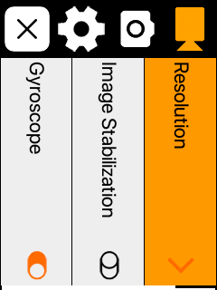
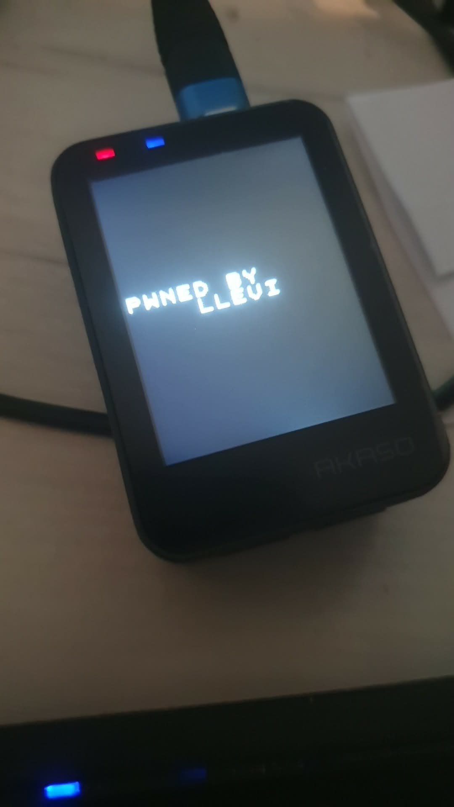

# Akaso-V50X-Hacking
Reverse Engineering and modifying Akaso V50X camera

## Disclaimer
This is a hardware and a firmware modification. This means you loose you warranty and risk your camera to be bricked. Use this method for your own risk.
I am not responsible for your broken camera

## Features
- Full root access
- Connect to an existing WiFi network instead of AP mode
- Telnetd and ftpd
- Use the screen to show arbitrary texts
- Rtsp server (IP cam mode)
- Make screenshots of the menu

## Usage
You have to disassemble the device and solder a generic UART to the board:
- with a really thin pry tool, disassemble the device from the screen side
- Solder an UART - USB converter cable to the pinpoints on the board. the pins are labeled correctly. Use 115200 baud
- You have root access without password on the camera via UART
- write the following lines to the end of /app/bootapp :
```bash
mkdir -p /dev/pts
mount -t devpts devpts /dev/pts
telnetd
sleep 10
mount -o remount,exec /app/sd
/app/sd/autorun.sh
```
- With theese you can
    - Use telnet to connect (with AP mode)
    - Run arbitrary commands from your sdcard

## Connect to WiFi Network
- Use my provided wpa_supplicant binary or
- Compile your own
    - make sure you have arm-linux-gnueabihf-gcc cross-compiler on your computer
    - wget https://w1.fi/releases/wpa_supplicant-2.10.tar.gz
    - tar xzf wpa_supplicant-2.10.tar.gz -C /tmp/
    - tweak your .config until it works (sorry)
    - make CC=arm-linux-gnueabihf-gcc LDFLAGS="-static" and copy the binary to /app/sd/lib/wpa_supplicant
- copy the wpa_supplicant.conf to /app/sd/lib on the device
- set the desired IP address in autorun.sh
- After bootup, turn on AP mode immediatelly and quit it. It will initialize the WiFi and create the wlan0 interface

## Extra bootup message
- Use fbtext (source and bin provided)


## Screenshots
- copy the screenshot bin and the screenshot.sh wrapper. 
- Use the wrapper without args on the device.
- It makes the filename current date. it makes a .ppm format files but you can convert it to png anytime. 


## RTSP Stream
- I've reverse engineered the URLs:
- Use VLC With theese streams if you are on the same network:
rtsp://xx.xx.xx.xx:554/livestream/11
rtsp://xx.xx.xx.xx:554/livestream/12

## WiP: Run Alpine Linux in chroot
- We need to use a Symlink supporting FS, but we don't have the support for it.
- Let's cross compile the kernel modules to be able to use ext4, on your computer:
  ```
    cd /tmp
    wget https://cdn.kernel.org/pub/linux/kernel/v4.x/linux-4.9.37.tar.xz # Change the version if you have other kernel version
    tar -xf linux-4.9.37.tar.xz
    cd linux-4.9.37
    sudo apt update
    sudo apt install -y gcc-arm-linux-gnueabihf
    make ARCH=arm CROSS_COMPILE=arm-linux-gnueabihf- HOSTCFLAGS=-fcommon defconfig && \
    scripts/config --disable CONFIG_SMP && \
    scripts/config --module CONFIG_EXT4_FS && \
    scripts/config --module CONFIG_JBD2 && \
    scripts/config --module CONFIG_FS_MBCACHE && \
    scripts/config --module CONFIG_BLK_DEV_LOOP && \
    rm -f include/config/auto.conf include/config/auto.conf.cmd include/generated/autoconf.h && \
    make ARCH=arm CROSS_COMPILE=arm-linux-gnueabihf- HOSTCFLAGS=-fcommon oldconfig < /dev/null && \
    make ARCH=arm CROSS_COMPILE=arm-linux-gnueabihf- HOSTCFLAGS=-fcommon prepare modules_prepare && \
    echo '=== CONFIG ===' && \
    grep -E '^CONFIG_(EXT4_FS|JBD2|FS_MBCACHE|SMP)=' .config && \
    echo '=== AUTO.CONF ===' && \
    grep -E '^CONFIG_(EXT4_FS|JBD2|FS_MBCACHE|SMP)=' include/config/auto.conf && \
    echo '=== BUILD JBD2 ===' && \
    rm -f fs/jbd2/*.o fs/jbd2/jbd2.ko fs/jbd2/*.mod.c fs/jbd2/*.mod fs/jbd2/.*.cmd && \
    make ARCH=arm CROSS_COMPILE=arm-linux-gnueabihf- HOSTCFLAGS=-fcommon KCFLAGS=-march=armv7-a M=fs/jbd2 modules -j$(nproc) && \
    echo '=== BUILD MBCACHE ===' && \
    rm -f fs/mbcache.o fs/mbcache.ko fs/mbcache.mod.c fs/mbcache.mod fs/.*.cmd && \
    make ARCH=arm CROSS_COMPILE=arm-linux-gnueabihf- HOSTCFLAGS=-fcommon KCFLAGS=-march=armv7-a M=fs modules -j$(nproc) && \
    echo '=== BUILD EXT4 ===' && \
    rm -f fs/ext4/*.o fs/ext4/ext4.ko fs/ext4/*.mod.c fs/ext4/*.mod fs/ext4/.*.cmd && \
    make ARCH=arm CROSS_COMPILE=arm-linux-gnueabihf- HOSTCFLAGS=-fcommon KCFLAGS=-march=armv7-a M=fs/ext4 modules -j$(nproc) && \
    make ARCH=arm CROSS_COMPILE=arm-linux-gnueabihf- HOSTCFLAGS=-fcommon KCFLAGS=-march=armv7-a M=drivers/block modules -j$(nproc)
    echo '=== RESULT ===' && \
    find fs -maxdepth 2 -name '*.ko' -ls && \
    echo '=== VERMAGIC ===' && \
    strings fs/jbd2/jbd2.ko fs/ext4/ext4.ko 2>/dev/null | grep '^vermagic=' && \
    file fs/mbcache.ko fs/jbd2/jbd2.ko fs/ext4/ext4.ko
  ```
- Upload them to /app/sd/lib/komod

- Sadly, i was not able to use loop device yet since the kernel module didn't work on this custom kernel. So I reformatted my sdcard to have 2 partitions, one is the usual vfat and the other is an ext4 to run alpine linux in it (vfat doesn't support symlinks)
- Followed this: https://wiki.alpinelinux.org/wiki/Alpine_Linux_in_a_chroot to run a chroot
- Run these commands to start the alpine environment:
```
mkdir /dev/alpine-root
insmod /app/sd/lib/komod/jbd2.ko 
insmod /app/sd/lib/komod/mbcache.ko 
insmod /app/sd/lib/komod/ext4.ko 
mount /dev/mmcblk0p2 /dev/alpine-root
cd /dev/alpine-root
chroot .
```
## Happy hacking






